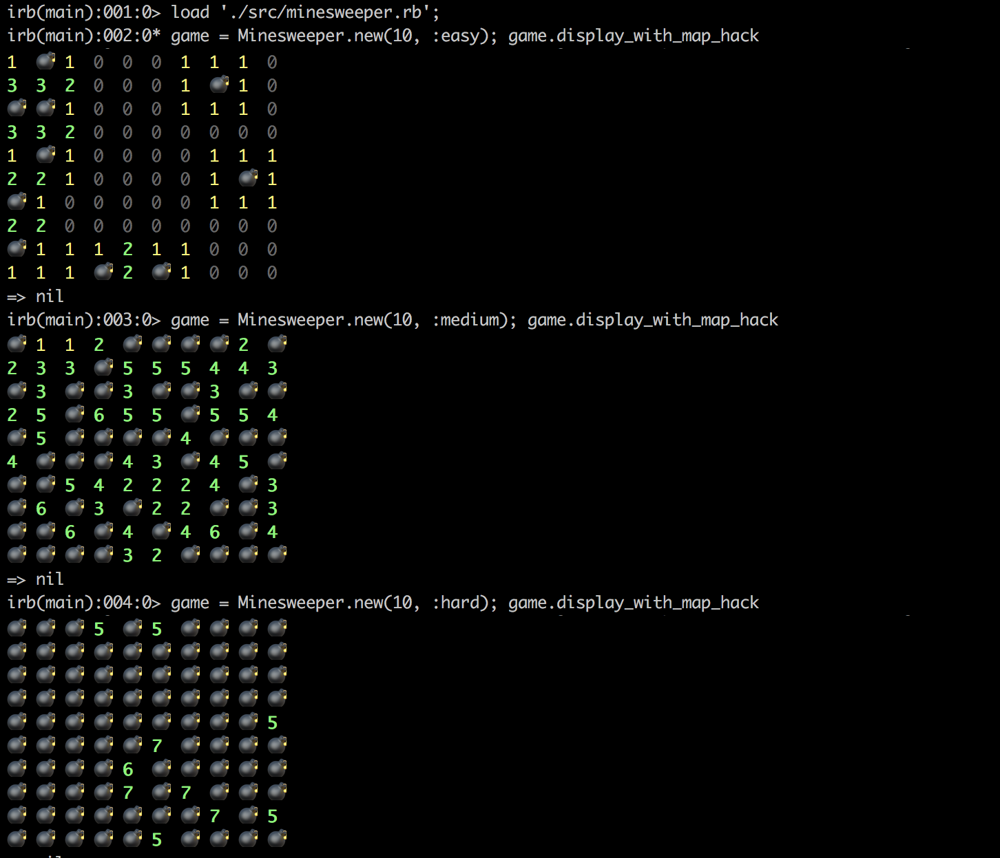
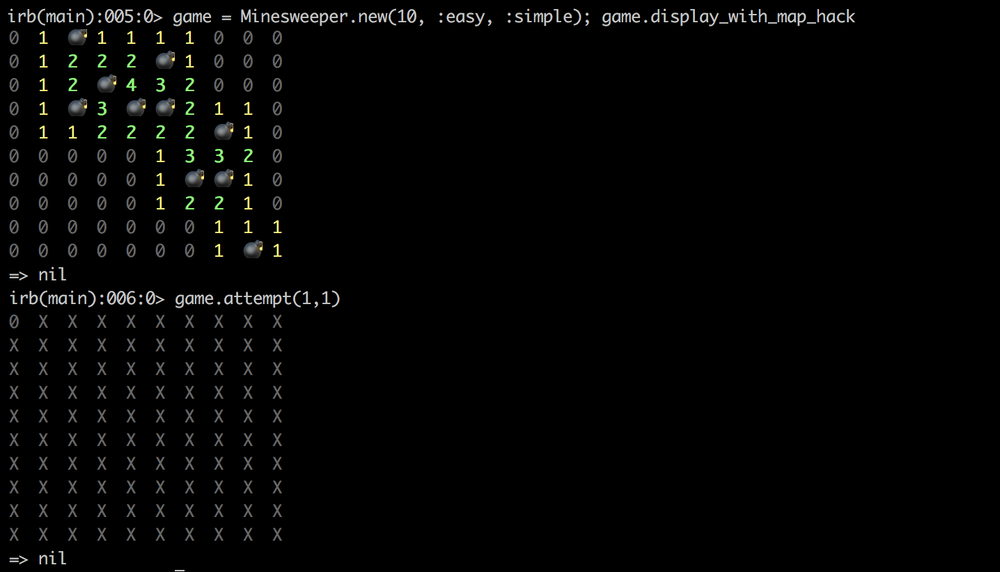
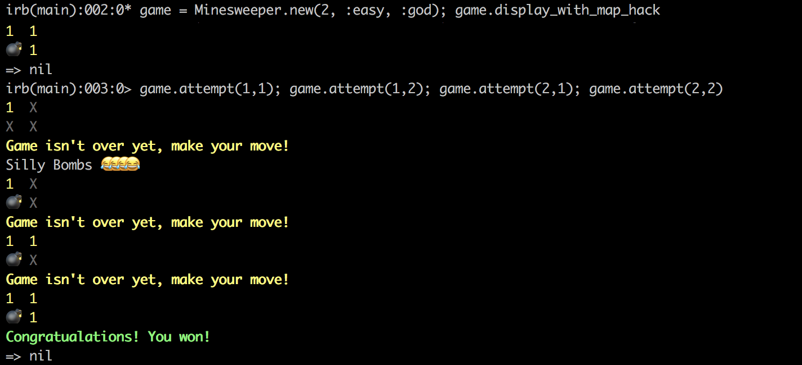

# Minesweeper


## How to play?


### Start the Game

```bash
$ irb
```

```ruby
irb(main) > load './src/minesweeper.rb'
irb(main) > game = Minesweeper.new(25)
```

### Viewing the Board
```ruby
irb(main) > game.display
```

### Selecting a Cell
```ruby
irb(main) > game.attempt(1, 1)
```

### Selecting a Level of Difficulty
Currently there are 4 difficulties: `easy`, `medium`, `hard`, and `dagumak`

`Easy` has the least bombs randomly placed on the board.

`Medium` is somewhere in between.

`Hard` has the most bombs randomly placed on the board. 

`dagumak` will always place the bombs in the same place.

```ruby
irb(main) > load './src/minesweeper.rb'
irb(main) > game = Minesweeper.new(10, :easy)
```




### Selecting a Game Mode
Currently there are 3 different game modes: `simple`, `normal`, and `god`

`simple` 

Unlike how the normal game behaves, when selecting an empty cell then it will not reveal the neibhoring empty cells.

`normal` 

Just normal. This is the default.

`god`

You're legendary, a god. Bombs don't affect you.

```ruby
irb(main) > load './src/minesweeper.rb'
irb(main) > game = Minesweeper.new(10, :easy, :simple)
```

Example of `simple`, notice it only reveals the selected cell:


Example of `normal`, notice it only reveals all the neighboring empty cells:


## Fun Features

#### Dagumak Level Difficulty

```ruby
irb(main) > load './src/minesweeper.rb'
irb(main) > game = Minesweeper.new(25, :dagumak)
irb(main) > game.display_with_map_hack
```

#### Map Hack
This will unveil the fog of war and reveal all the whole board.

```ruby
irb(main) > load './src/minesweeper.rb'
irb(main) > game = Minesweeper.new(25)
irb(main) > game.display_with_map_hack
```

#### God Mode
This will grant the player god mode. In god mode, you can select a cell that is a bomb without penalty; you will *eventually* always win.

```ruby
irb(main) > load './src/minesweeper.rb'
irb(main) > game = Minesweeper.new(25, :hard, :god)
```



# Developer Notes
## Architecture Overview

`class Minesweeper`

> This class is for player interaction; the class displays the board to the player, understands the current game state (ex, in progress, loss, or win), and allows players to make a move. It's main function is to orchestrate other classes to make a functional game.

`class Board`

> This class is for managing the Minesweeper matrix itself. It understands how to populate all the `bomb-adjacent-numbers`, but does not know where to places the bombs; it knows how to surround bombs with numbers, but does not know where to places the actual bombs itself. It relies on `BoardPopulatorFactory` for bomb placement.

`class BoardPopulatorFactory`

> This class is factory collection of strategies available for bomb placement. Currently, we have 4 difficulties which is easy, medium, hard, and dagumak. There is a strategy class for each of the difficulties and each strategy understands how many bombs it has to place and sets it on the board.

`class GameModeFactory`

> This class is factory collection of game modes. A game mode determines how the Minesweeper game should react when you select a cell to reveal and the winning condition. For example, in `SimpleGameModeStrategy`, when you select a cell that is empty then it just reveals that cell. However, in `NormalGameModeStrategy` when you select an empty cell, then it proceeds to reveal all empty cells connected until it reaches a number. Lastly, in `GodGameModeStrategy` when you select a cell and it's a bomb, nothing happens because you're in god mode.


## Code Terminology
`indices` - This is the index used to access a matrices in `class Board`. These numbers start at 0. Indices use `i_index, j_index` variables to prevent confusion with `coordinates`. 

`coordinates` - This is a pair of number for the player to select a cell on the board. Coordinates use `x, y` variables and start from 1 because normal players will start counting a column or row from 1. 

`bomb-adjacent-numbers` - The numbers surrounding a given bomb are the adjacent numbers. Each number represents the number of bombs that is surrounding it.

## Adding Additional Difficulties (Bomb Populating Strategies)
Currently there are only 4 difficulties: `easy`, `medium`, `hard`, and `dagumak`

Perhaps you want to perform different algorithms to better spread out the bomb placement or you want to create weird and wacky bomb placements that just run around the border, you can extend this program using the strategy pattern by implementing your own strategy.

If you wanted to add additional difficulties, you could create a new strategy and update the switch case statement to include your new strategy. Please refer to existing strategies such as `DagumakBoardPopulatorStrategy`, `BaseBoardPopulatorStrategy` and `MediumBoardPopulatorStrategy`.

All Populator Strategies have to implement the following methods:
* `populate` - it must return the `board`.
* `won?` - a win-condition for the strategy to be considered a win

## Adding Additional Game Modes

Let's say we want to just disable bomb detonation, we can add a strategy pattern called `GodGameModeStrategy` that will essentially always allow us to win because we can't lose. Actually, this already exists. Please refer to `Fun Features` section

## Running Tests
```bash
$ rspec
```

## Running the Linter
```bash
$ rubocop src/ --auto-correct
```

## Easy Copypasta

For irb console:

```irb
load './src/minesweeper.rb'; 
game = Minesweeper.new(2, :easy); game.display_with_map_hack
game = Minesweeper.new(10, :easy); game.display_with_map_hack
game = Minesweeper.new(10, :medium); game.display_with_map_hack
game = Minesweeper.new(10, :hard); game.display_with_map_hack

game = Minesweeper.new(10, :easy, :simple); game.display_with_map_hack
game = Minesweeper.new(10, :easy, :normal); game.display_with_map_hack

game = Minesweeper.new(10, :hard, :god); game.display_with_map_hack
```

## TODO 
* Flags - diffusing bomb
* Add tests for the game mode strategies
* Add tests for board populating strategies